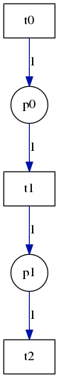

Petri
=====

A petri net library for ocaml. Currently in early development.

## Overview

The simplest way to create a petri net is to specify a list of arc descriptors. Each arc descriptor contains the id to draw the arc from, the id to draw the arc to, and the weight of the arc. The following program sets up a simple petri net and displays it using graphviz and imagemagick.

    open Petri
    open Petri.ArcDescriptor

    let arcs = [
      Transition 0, Place 0,      1;
      Place 0,      Transition 1, 1;
      Transition 1, Place 1,      1;
      Place 1,      Transition 2, 1
    ]

    let _ = Net.make 2 3 arcs |> Visualize.display_net_graph

