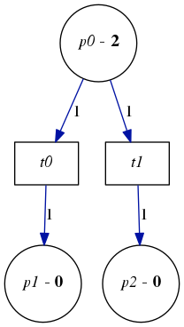
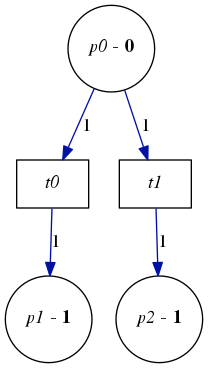

Petri
=====

A petri net library for ocaml. Currently in early development.

## Overview

The simplest way to create a petri net is to specify a list of arc descriptors. Each arc descriptor contains the id to draw the arc from, the id to draw the arc to, and the weight of the arc. The following program sets up a simple petri net and displays it using graphviz and imagemagick.

    open Petri
    open Petri.ArcDescriptor

    let arcs = [
      Transition 0, Place 0,      1;
      Place 0,      Transition 1, 1;
      Transition 1, Place 1,      1;
      Place 1,      Transition 2, 1
    ]

    let _ = Net.make 2 3 arcs |> Visualize.display_net_graph

##### Output

Petri nets can be marked and fired. The marking should be an `int array` with the same length as the number of places in the net. When firing a net, an `bool array` with the same length as the number of transitions in the net should be passed in to determine which transistions fire during.

    open Petri
    open Petri.ArcDescriptor

    let arcs = [
      Place 0,      Transition 0, 1;
      Place 0,      Transition 1, 1;
      Transition 0, Place 1,      1;
      Transition 1, Place 2,      1
    ]

    let initial_marking = [|2; 0; 0|]

    let _ =
      let net = Net.make 3 2 arcs in
      Visualize.display_net_graph ~marking:(Some initial_marking) net;
      let next_marking = Net.fire (net, initial_marking) [|true; true|] in
      Visualize.display_net_graph ~marking:(Some next_marking) net

##### Initial state

##### After firing

